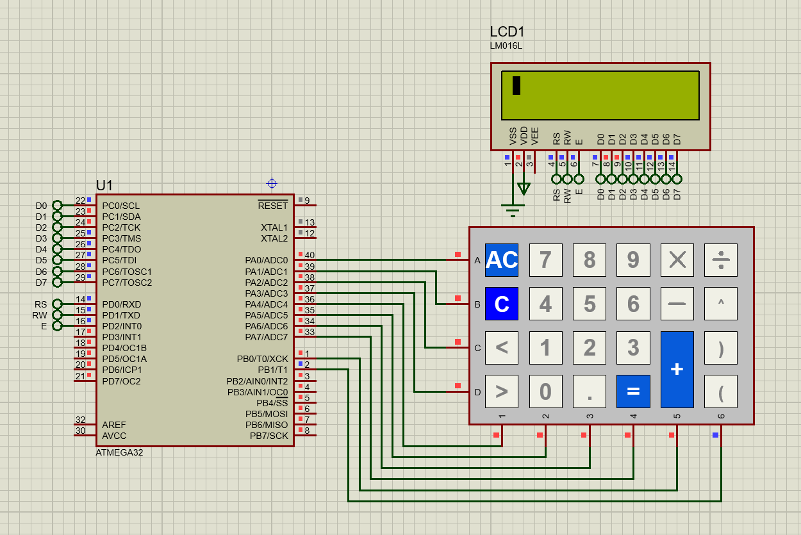

# Calculator using AVR 🧮

This embedded project implements a calculator using the AVR architecture, organized in a layered structure (MCAL-HAL-APP). The calculator supports a range of mathematical operations and follows a systematic process for expression evaluation.

## Table of Contents 📚

- [Construction](#construction)
- [Supported Calculations](#supported-calculations-)
- [How It Works](#how-it-works-%EF%B8%8F)
  - [Expression Conversion](#expression-conversion-%EF%B8%8F)
  - [Operands Storage](#Operands-storage-)
  - [Infix to Postfix Conversion](#infix-to-postfix-conversion-%EF%B8%8F)
  - [Postfix Evaluation](#postfix-evaluation-)
- [Testing](#testing-)
- [Circuit Connection](#circuit-connection-)

## Construction

This calculator project is organized into four layers:

1. **MCAL (Microcontroller Abstraction Layer):** The lowest layer that abstracts the hardware details of the AVR microcontroller.
2. **HAL (Hardware Abstraction Layer):** This layer provides a set of high-level functions to interact with the hardware components, enabling easier development of applications.
3. **APP (Application):** The top layer where the calculator logic is implemented.
4. **Lib (Libraries):** The place where I implement my math functions, errorstates, and standard types.

## Supported Calculations ✅

The calculator supports basic arithmetic operations such as addition, subtraction, multiplication, and division. It can also handle parentheses, allowing users to input complex mathematical expressions. Furthermore, the calculator supports floating-point numbers for precise calculations.

### Testing 🎥

Check out the testing video to see the calculator in action:

https://github.com/hamed2634/Calculator_Using_AVR/assets/52867472/cc098352-3f5c-44f4-ba3f-541029177e0c

### Circuit Connection 📷

Here's a photo showcasing the circuit connections:

## How It Works 🛠️

### Expression Conversion ➡️

The first step is to convert the user-input mathematical expression into a standardized format.

For example, the expression `2*(1.9+0.1)` is converted to `A*(B+C)`.

### Operands Storage 📊

The converted expression is then parsed, and variables (A, B, C, etc.) are stored in an array of doubles.

In our example, A is equivalent to 2, B is 1.9, and C is 0.1.

### Infix to Postfix Conversion ↔️

The infix expression is further converted to a postfix expression based on stack using my code in my DataStructure repository [Here](https://github.com/hamed2634/Data_Structure/tree/master/infix%20to%20postfix%20using%20stack). 

The postfix expression simplifies the evaluation process.

### Postfix Evaluation 🔄

Finally, the postfix expression is evaluated using a stack-based approach. 

The AVR microcontroller efficiently processes each element of the expression and computes the result, adhering to the rules of the postfix notation.

**This project's modular design and layered architecture make it flexible for future enhancements and adaptations.**
